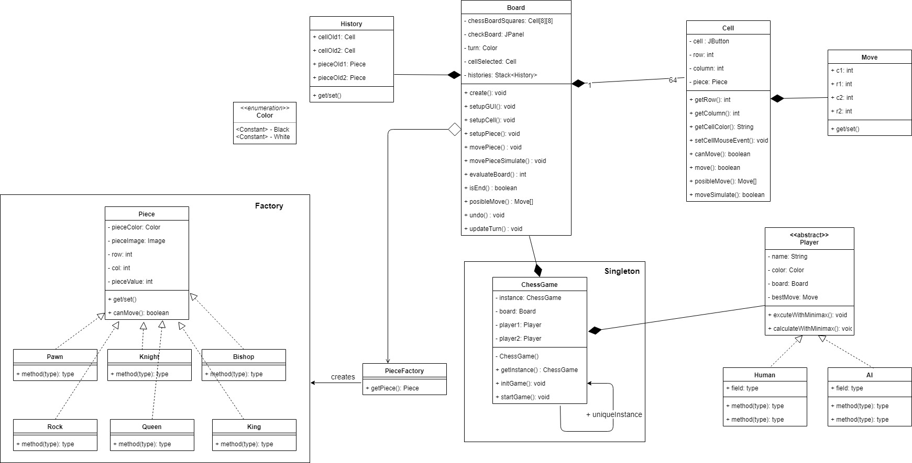

# Jeu d'echec

Auteur: TRAN Bao Thien - uapv1900181 - M2 ILSEN CLA

## Diagramme de classe

Diagramme est constitué de 5 parties principales : Board, Cell, Piece, ChessGame et Player.

- Board : contient les principaux attributs du jeu comme : Cell[8][8], JPanel gui, …Il est responsable de la configuration de l'interface du jeu.
	setupGUI() : mettre en place le cadre de l'échiquier grâce à JFrame
	setupCell() : mettre en place 64 boutons noir et blanche grâce à JButton
	setupPiece() : mettre en place les pièces
	movePiece() : pour déplacer les pièces
	movePieceSimulate () : pour déplacer une pièce (ne change pas l'image de la pièce)
	updateTurn() : gérer le jeu au tour par tour
	posibleMove() : prendre tous les mouvements possibles de toutes les pièces
	isEnd() : vérifier la fin du jeu

- Cell : aide à conserver l'état des pièces d'échecs et à gérer les événements de la souris
	setCellMouseEvent() : mettre en place des événements de souris pour les boutons
	move() : pour déplacer une pièce
	moveSimulate() : pour déplacer une pièce (ne change pas l'image de la pièce)
	posibleMove() : prendre tous les mouvements possibles de la pièce en cours

- Piece : c’est une classe abstraite. Les classes étendues (Pawn, King, Queen, Rook, Knight, Bishop) mettent en œuvre les opérations abstraites
	canMove() : le mouvement valide pour une pièce. Cette méthode implémente les règles de mouvement. Par exemple, le canMove () d'une classe de Pions assure que le Pion ne peut se déplacer que dans la direction du côté adverse. En plus, dans chaque classe étendue, il y a les méthodes conditionAttack() et conditionMove() pour déterminer le mouvement des pièces.

- ChessGame : pour contrôler le déroulement d'un jeu. Cette classe possède des principales méthodes suivantes
	initGame() : mettre en place les joueurs et l’interface
	startGame() : contrôler le déroulement d'un jeu

- Player : pour représente le joueur. Notamment  l’implémentation d’une intelligence artificielle (algorithme min-max)
	calculateWithMinimax() : trouver le meilleur façon pour déplacer les pièce grâce à algorithme min-max.
	excuteWithMinimax() : après avoir calculé le meilleur façon, cette méthode permet de réaliser le meilleur mouvement.

## Design Pattern
### MVC
- J’ai choisi le design pattern MVC car il permet de séparer les données (le modèle), l’interface homme-machine (la vue) et la logique de contrôle (le contrôleur).
- Le contrôleur (ChessGame) est un niveau qui agit comme un cerveau de l'ensemble du système MVC. Ce contrôleur sert également de lien entre un modèle et la vue.
- La vue (Board) fournit une interface graphique ainsi que l'initialisation nécessaire pour l'échiquier.
- Les modèles comme Piece, Cell, Player qui représentent les données pour le jeu. Ce niveau définit où sont stockés les objets de données de l'application.
### Singleton
- J'ai choisi le design pattern Singleton pour la classe ChessGame car il permet de s’assurer qu’il n’existe qu’une unique instance d’une classe donnée. Cela garantit qu’un seul contrôleur existe.
### Factory
- J’ai choisi le design pattern Factory pour la classe Piece car il permet de créer un objet dont le type dépend du contexte. L’objet fait partie d’un ensemble sous-classes. Cela garantit qu’un objet retourné par Factory est toujours du type de la classe Piece.

## Algorithme min-max
Min-max est un algorithme que nous pouvons utiliser pour évaluer tous les coups possibles qu'un joueur peut faire. Nous suivons chaque mouvement jusqu'à une certaine profondeur, ce qui, dans ce cas, est le nombre de mouvements que nous voulons regarder en avant. Notre évaluation sera relative à un joueur, et ce joueur tentera d'obtenir le meilleur score possible (maximiser sa position). L'adversaire fait le contraire: essayer de minimiser la valeur du joueur original (ce qui, essentiellement, maximise la valeur de l'adversaire). 

## Fonctionnalités réalisées
- Concevoir le moteur du jeu d'échec, c'est-à-dire l'échiquier, les pièces (et leurs déplacements).
- Mettre en place 3 différents designs patterns vu en modélisation du logiciel (MVC, Singleton, Factory).
- Informer la fin du jeu.
- Fournir les cas particuliers comme : promotion …
- Fournir une interface graphique grâce aux JavaSwing.
- Fournir une version séquentielle de l’intelligence artificielle (algorithme min-max).